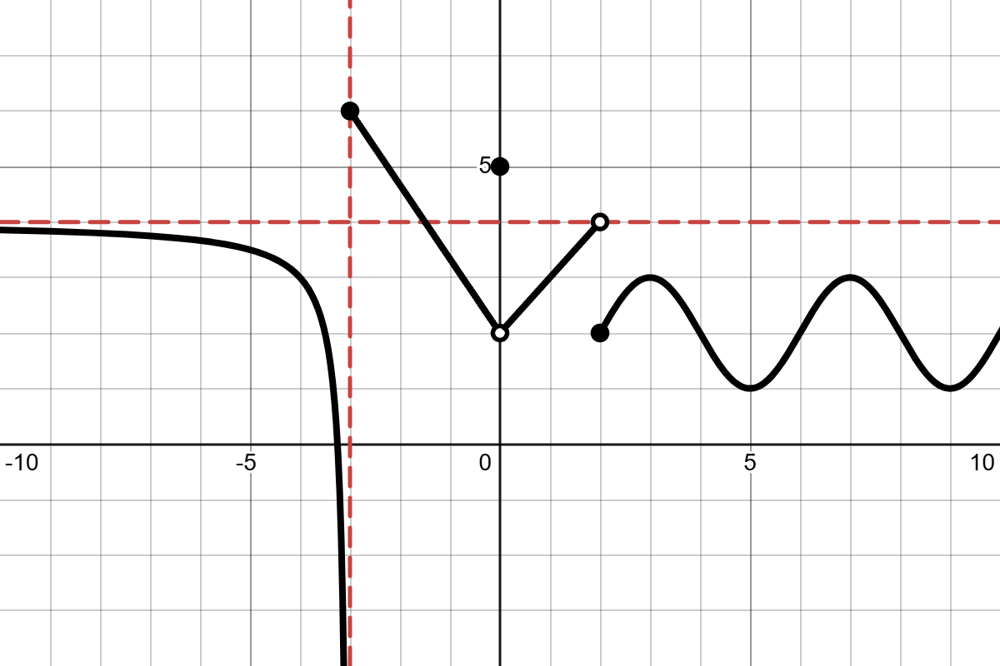

## Definition of a limit
When computing a *limit*, we are trying to determine the end result of an indefinite process. Like with the light switch example in the Unit 1 Overview, some indefinite processes do not yield a final outcome. In these cases, we say that the limit of the process *does not exist*. 

In other instances, like with the value of $0.999\ldots$, we will be able to see that the outcomes of the process ($0.9$, $0.99$, $0.999$, $\ldots$) become infinitesimally close to a specific value and we define this value to be the *limit* of the process.

The process we are interested in here is the value a function $f(x)$ approaches as $x$ approaches a particular input value $x=a$ or as $x$ tends towards $\infty$ or $-\infty$. We use the following notation when trying to compute the limit in this context: $$\lim_{x\to a}f(x).$$ 

Note that $\displaystyle\lim_{x\to a}f(x)$ and $f(a)$ are asking two *different* questions:

- $\displaystyle\lim_{x\to a}f(x)$ is asking us to examine the behavior of the output values of $f$ as the input values get closer and closer to $x=a$; at no point in this process do we plug in $x=a$.
- $f(a)$ is asking for the output value that we get when we plug in $x=a$.

In some cases, these questions have the same answer. We say that the function is *continuous* at $x=a$ when this happens. In other cases, they do not. But it is always important to keep in mind that these are two distinct questions!

Here are some formal definitions for the different kinds of limits we will use in this context:

:::{#def-limit}
### Limit
For a given real number $a$, we write that $$\lim_{x\to a}f(x)=L$$ when there is a real number $L$ such that the values of $f(x)$ can be made arbitrarily close to $L$ by plugging in any $x$ value that is sufficiently close to, but not equal to $a$. In this case, we say that the limit of $f(x)$ as $x$ approaches $a$ exists and equals $L$. 
::: 

:::{#def-lim_infty}
### Limits at Infinity
We write that $$\lim_{x\to \infty}f(x)=L$$ when there is a real number $L$ such that the values of $f(x)$ can be made arbitrarily close to $L$ by plugging in sufficiently large values for $x$.

We write $$\lim_{x\to -\infty}f(x)=L$$ when there is a real number $L$ such that the values of $f(x)$ can be made arbitrarily close to $L$ by plugging in negative values for $x$ that are sufficiently large in magnitude.

In these cases, we say that the limit of $f(x)$ as $x$ approaches infinity or negative infinity exists and equals $L$. 
:::

:::{#def-one_sided_lim}
For a given real number $a$, we write that $$\lim_{x\to a^+}f(x)=L$$ if there is a real number $L$ such that the values of $f(x)$ can be made arbitrarily close to $L$ by plugging in any $x$ value that sufficiently close to, but greater than $a$.

We write that $$\lim_{x\to a^-}f(x)=L$$ if there is a real number $L$ such that the values of $f(x)$ can be made arbitrarily close to $L$ by plugging in any $x$ value that sufficiently close to, but less than $a$.

In these cases, we say that the limit of $f(x)$ as $x$ approaches a from the right ($x\to a^+$), or from the left ($x\to a^-$), exists and equals $L$.
:::

### Problem 1: Exist or Does Not Exist?
Let $f(x)$ be the function shown in the graph below.

{#fig-limit-example width=70%}

Evaluate each of the following limits or indicate they do not exist by writing DNE, $\infty$, or $-\infty$ as appropriate.

::::{layout-ncol=2}

:::{#part-a}
**(a)** $\displaystyle\lim_{x\to 0}f(x)$
:::

:::{#part-b}
**(b)** $\displaystyle\lim_{x\to -\infty}f(x)$
:::

:::{#part-c}
**(c)** $\displaystyle\lim_{x\to -3^+}f(x)$
:::

:::{#part-d}
**(d)** $\displaystyle\lim_{x\to -3^-}f(x)$
:::

:::{#part-e}
**(e)** $\displaystyle\lim_{x\to 2}f(x)$
:::

:::{#part-f}
**(f)** $\displaystyle\lim_{x\to \infty}f(x)$
:::

::::

### Problem 2: Holes vs. Asymptotes
Let $f(x) = \dfrac{x^2+2x-3}{x+1}$ and $g(x) = \dfrac{x^2-2x-3}{x+1}$.

a. Fill out the following table of values:

| $x$    | -1.1 | -1.01 | -1.001 | -0.999 | -0.99 | -0.9 |
|--------|------|-------|--------|--------|-------|------|
| $f(x)$ |      |       |        |        |       |      |
| $g(x)$ |      |       |        |        |       |      |

b. Use the table to guess the value of the following limits. If the limit does not exist, write DNE, $\infty$, or $-\infty$ as appropriate.

::::{layout-ncol=3}
  
:::{#part-i}  
**i.** $\lim_{x\to -1^-} f(x)$
:::
  
:::{#part-ii}  
**ii.** $\lim_{x\to -1^+} f(x)$
:::
  
:::{#part-iii}  
**iii.** $\lim_{x\to -1} f(x)$
:::
  
:::{#part-iv}  
**iv.** $\lim_{x\to -1^-} g(x)$
:::
  
:::{#part-v}  
**v.** $\lim_{x\to -1^-} g(x)$
:::
  
:::{#part-vi}  
**vi.** $\lim_{x\to -1} g(x)$
:::

::::

## Definition of Continuity
One property we frequently look for in functions is their *continuity*. This is a particular nice property to have if $y=f(x)$ is the model for some real world relationship. If $f$ is continuous at $x=a$ and $f(a)=b$, then we know that sufficiently small errors in our input value (e.g. maybe $a$ gets rounded to the nearest 0.01) will produce an output value that is within some desired margin of error around $b$.

In terms of limits, as noted above, knowing a function is continuous at $x=a$ makes evaluating the limit really easy---all we have to do in this case is plug in $x=a$.

Here is our formal definition:

:::{#def-continuity}
### Continuity 
We say that $f(x)$ is continuous at $x=a$ if $$\lim_{x\to a}f(x)=f(a)$$
:::

### Problem 3: Making a Piecewise Function Continuous
Let

$$
h(x) = \begin{cases} ax^2+2 & \text{if } x<1 \\ 4 & \text{if } x=1 \\ -3x+b & \text{if } x>1 \end{cases}
$$

a. [Here is a link to a graph of $h(x)$ in Desmos.](https://www.desmos.com/calculator/k9s00vtasu) Use the sliders to help you guess the values of $a$ and $b$ that make $h(x)$ continuous at $x=1$.
b. Verify your answer to part (a) algebraically.

### Problem 4: Drug Decay
A 0.6 mL dose of a drug is administered to a patient steadily for half a second. At the end of this time, the quantity $Q$ of the drug in the body starts to decay exponentially. The continuous decay rate of the drug is 0.2% per second.

a. Let $Q(t)$ be the amount of drug in the body $t$ seconds after the drug began to be administered. Do you expect $Q(t)$ to be continuous for $t>0$?
b. Find a formula for $Q(t)$.