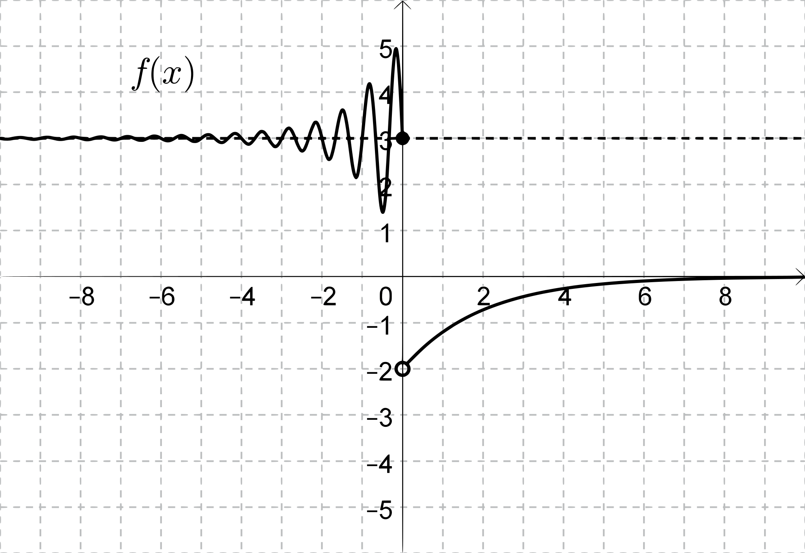
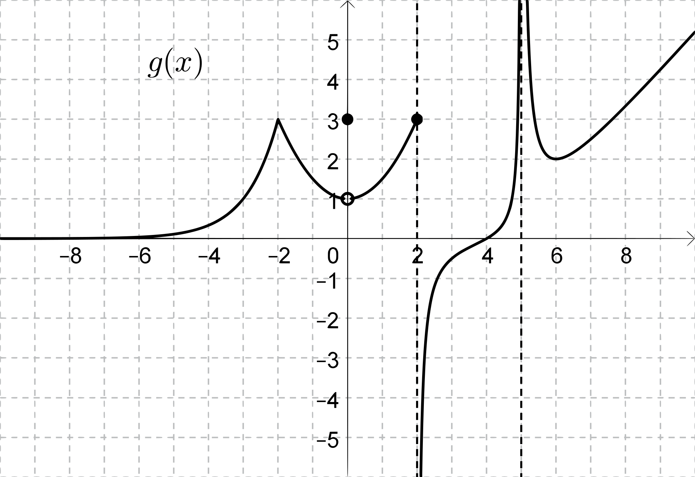

Now that we have some intuition about what a limit of a function is and what it means for a function to be continuous, we can dig a little deeper into how these ideas work and how they can be applied.

First, let's consider what happens when we take the limit of a combination of functions. If we know that $\lim_{x\to a}f(x)=L$ and $\lim_{x\to a}g(x)=M$, can we figure out what happens when we compute the limit of some combination of $f(x)$ and $g(x)$? For example, your intuition probably tells you that $S(x)=f(x)+g(x)$ will approach $L+M$ as $x$ approaches $a$, but can we explain *why* this is correct?

Take an $x$-value close to $a$, say $x=a+t$ where $t$ is a small positive or negative number. Since $\lim_{x\to a}f(x)=L$ and $\lim_{x\to a}g(x)=M$, we know that $f(a+t)=L+\epsilon$ and $g(a+t)=M+\delta$, where $\epsilon$ and $\delta$ are themselves small — the closer $x$ is to $a$ (the smaller $t$ is), the smaller $\epsilon$ and $\delta$ get.

Adding these together, $$S(a+t)=f(a+t)+g(a+t)=(L+\epsilon)+(M+\delta)=L+M+(\epsilon+\delta).$$ Since $\epsilon$ and $\delta$ are both small, their sum $\epsilon+\delta$ is small too.

Now let $x$ get closer and closer to $a$: $t$ shrinks toward $0$, which forces $\epsilon$ and $\delta$ — and therefore $\epsilon+\delta$ — to shrink toward $0$ as well. That's exactly what it means for $S(x)=f(x)+g(x)$ to approach $L+M$ as $x\to a$.

Similar reasoning can help you figure out and explain the properties listed in the following theorem. These properties are listed in terms of two-sided limits, but they also apply to one-sided limits, and limits as $x\to \pm\infty$:

::: {#thm-limit-prop}

## Limit Properties

If 
$$\lim_{x\to a}f(x)=L \text{ and } \lim_{x\to a}g(x)=M,$$
then:

a. $\displaystyle\lim_{x\to a}\left[f(x)\pm g(x)\right]=L\pm M$
b. $\displaystyle\lim_{x\to a}\left[f(x)\cdot g(x)\right]=L\cdot M$
c. $\displaystyle\lim_{x\to a}\left[\frac{f(x)}{g(x)}\right]=\frac{L}{M},~~$ as long as $M\neq 0$
:::

### Problem 1: Using Limit Properties

The functions $f(x)$ and $g(x)$ are shown in the graphs below. Assume that the viewing window is large enough to show the end behavior of each function.

::: {layout-ncol=2}

:::

a. Find all $x$-values in the domain of each function where the function is not continuous.

b. Evaluate the following limits. If the limit does not exist but the function grows arbitrarily large in magnitude, write $\infty$ or $-\infty$. Otherwise, write the value of the limit or DNE.

::: {.columns-2}
i. $\displaystyle\lim_{x\to-\infty}f(x)$
ii. $\displaystyle\lim_{x\to 0}f(x)$
iii. $\displaystyle\lim_{x\to 0}g(x)$
iv. $\displaystyle\lim_{x\to 2^{-}}g(x)$
v. $\displaystyle\lim_{x\to 0^+}g(3x+2)$
vi. $\displaystyle\lim_{x\to -2}\big(f(x)+g(x)\big)$
vii. $\displaystyle\lim_{x\to 5}\frac{1}{g(x)}
viii. $\displaystyle\lim_{x\to -\infty}f(x)g(x)$
ix. $\displaystyle\lim_{x\to -\infty} f(g(x))$
:::

### Problem 2: Complicated Limit?
Evaluate the following limit:
$$\lim_{x\to 1}\ln\left(\frac{2\sqrt{x}-1}{e^x\cdot\sin(0.5\pi x^2)}\right)$$

### Problem 2: True/False?
Decide with your group if you think the following statements are true or false. If you think they are true, explain why. If you think they are false, provide an example showing why they are false.

a. If $\displaystyle\lim_{x\to a}f(x)=L$ where $L\neq 0$, and $\lim_{x\to a}g(x)=0$, then $$\lim_{x\to a}\frac{f(x)}{g(x)}=\text{DNE}$$
b. If $\displaystyle\lim_{x\to a}f(x)=0$ and $\lim_{x\to a}g(x)=0$, then $$\lim_{x\to a}\frac{f(x)}{g(x)}=\text{DNE}$$
c. If $\displaystyle\lim_{x\to a}f(x)=\infty$ and $\lim_{x\to a}g(x)=\infty$, then $$\lim_{x\to a}\left[f(x)-g(x)\right]=0$$
d.If $\displaystyle\lim_{x\to a}f(x)=0$ and $\lim_{x\to a}g(x)=\infty$, then $$\lim_{x\to a}f(x)\cdot g(x)=0$$