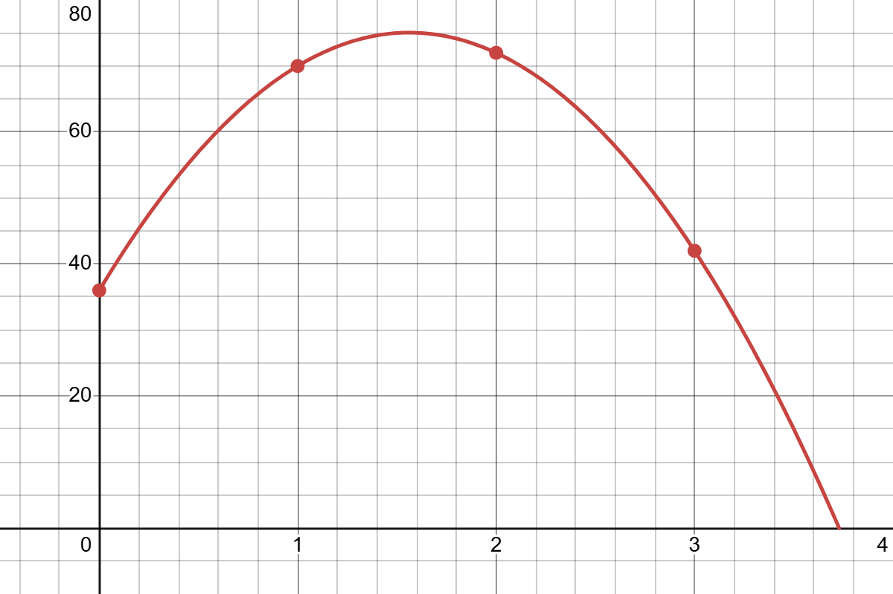

<!-- In the introduction to this unit, our goal was to measure how fast something was moving at a single instant in time.  immediately ran into a problem however - speed seems to require *two* points in time to measure — a change in position and a change in time. Let's make this precise, and then figure out how to push past it.

If an object's position at time $t$ is given by a function $h(t)$, then the **average velocity** of the object over the interval from $t=a$ to $t=b$ is
$$\text{average velocity on } [a,b] = \frac{h(b)-h(a)}{b-a}.$$
This is just the familiar "change in position over change in time," and geometrically, it's the slope of the secant line connecting the points $(a,h(a))$ and $(b,h(b))$ on the graph of $h$.

Average velocity is something we can always compute directly from the definition of $h(t)$ — no new ideas needed. The trouble is that it describes an *interval* of time, not an instant. So here's the key idea: what happens to the average velocity on $[a,b]$ as we let $b$ get closer and closer to $a$?

As $b\to a$, the interval $[a,b]$ shrinks down toward the single instant $t=a$, and the secant line connecting $(a,h(a))$ and $(b,h(b))$ should start to look more and more like the line that just grazes the graph at the point $(a,h(a))$ — what we'll eventually call the *tangent line*. This suggests a definition:

::: {#def-inst-velocity}
## Instantaneous Velocity

If an object's position at time $t$ is given by $h(t)$, then the object's **instantaneous velocity** at time $t=a$ is
$$v(a)=\lim_{b\to a}\frac{h(b)-h(a)}{b-a},$$
provided this limit exists.
:::

In other words, instantaneous velocity is what average velocity is "heading toward" as the length of the time interval shrinks to zero. Let's get some practice reasoning about this idea before we compute with it. -->

### Problem 1: Ranking Velocities

A person throws an object up into the air from a bridge. Its height above the ground $t$ seconds after it is thrown is given by the function
$$h(t)=-16t^2+50t+36.$$
The graph of this function is shown below.

](images/unit2_1_instvel.png){width=50%}

a. Rank the following from least to greatest:

    - A. The average velocity on $0\leq t\leq 1$
    - B. The average velocity on $2\leq t\leq 3$
    - C. The instantaneous velocity at $t=0$
    - D. The instantaneous velocity at $t=1$
    - E. The instantaneous velocity at $t=2$
    - F. The instantaneous velocity at $t=3$
    
b. Is there ever a moment when the velocity is $0$? If so, when?

### Problem 2: Estimating an Instantaneous Velocity

Using the same height function from Problem 2,
$$h(t)=-16t^2+50t+36,$$
shown again below,

{width=60%}

a. Compute the average velocity of the object over each of the following intervals:

    - $1\leq t\leq 1.1$
    - $1\leq t\leq 1.01$
    - $1\leq t\leq 1.001$
    - $0.9\leq t\leq 1$
    - $0.99\leq t\leq 1$
    - $0.999\leq t\leq 1$
    
b. Based on your answers to part (a), what do you think the instantaneous velocity of the object is at $t=1$?

### Problem 3: From Average to Instantaneous

Continuing with Problem 3, compute the value of the following limit:
$$\lim_{t\to 1}\frac{h(t)-h(1)}{t-1}$$

Explain the significance of the value you found — how does it relate to your answers in Problem 3?
