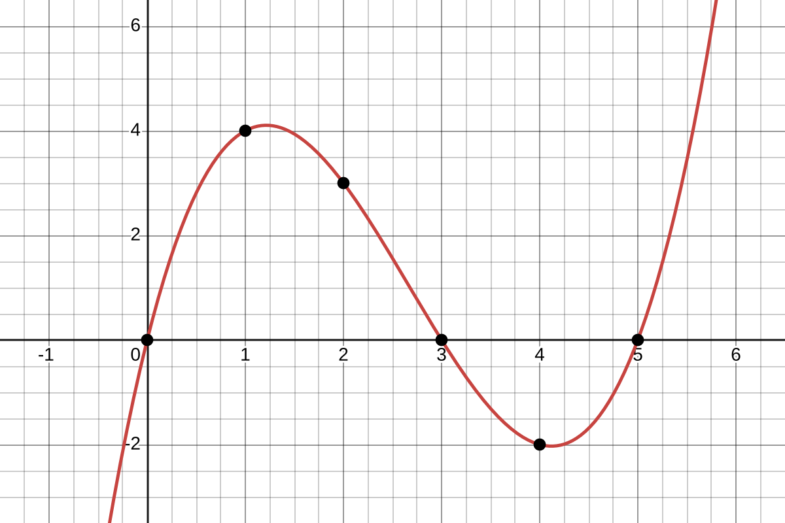

# Introduction

Today, we will generalize our idea of instantaneous velocity. Given any function $f(x)$, we can try to measure its *instantaneous rate of change* at a given point $x=a$ by computing its *average rate of change* over smaller and smaller intervals around $x=a$. 

As the width of these intervals shrinks down to $0$, if the values of the average rate of change appear to be approaching some real number $m$, we will take this value to be our instantaneous rate of change. We call this value *the derivative of $f(x)$ at $x=a$* and will use the notation $f'(a)$ to represent it symbolically.

As we saw with instantaneous velocity, we can write this definition of $f'(a)$ precisely in terms of limits.

:::{#def-deriv-t}
## Derivative at a Point
The *derivative of $f(x)$ at $x=a$*, or $f'(a)$, is   
$$f'(a)=\lim_{x\to a}\frac{f(x)-f(a)}{x-a}$$ 
:::

Instead of writing this limit in terms of a point $x$ that is getting closer and closer to $a$ (from both sides), we could write in terms of the width (and direction) of the interval on which we are computing the average rate of change of $f(x)$. Letting $h=x-a$, we get the following:

:::{#def-deriv-h}
## Derivative at a Point - Interval Version
$$ f'(a)=\lim_{h\to 0}\frac{f(a+h)-f(a)}{h}$$
:::

# Discussion Problems

## Problem 1 - Derivatives as Slope
The function $f(x)$ is shown in the graph below.

{width=75%}

a. Without computing anything, try to put the following values in order from least to greatest: $f'(0)$, $f'(1)$, $f'(2)$, $f'(3)$, $f'(4)$, $f'(5)$. 

b. Verify your work by estimating the values:

    | $a$ | 0 | 1 | 2 | 3 | 4 | 5 |
    | --- |---|---|---|---|---|---|
    | $f'(a)$ | | | | | | | 

c. [Here is a link to this graph in Desmos.](https://www.desmos.com/calculator/sclpufc2gq) Pick one of the points and zoom in on it. What do you notice happens to the graph as you zoom in? 

    Use this observation to help you guess the precise value of $f'(a)$ at this point.

d. Use the value you found for $f'(a)$ to write the equation of the line tangent to $f(x)$ at $x=a$. Add it to the graph of $f(x)$ to check your work. 

## Problem 2 - Estimating Derivatives
Let $f(x)=x^x$. Using the definition of the derivative and an appropriate table of values, estimate $f'(2)$. 

Do enough computations so that you are reasonably confident your estimate is accurate to 3 decimal places. 

## Problem 3 - Derivatives as Rates of Change
The data below shows the population for a country over the past ten years in millions:

|Time | 10 Years Ago | 5 Years Ago | Current|
|---|---|---|---|
|Pop. (in millions)| 472.4 | 496.0| 520.8|

a. Assuming that the population is growing exponentially, find a model $P(t)$ for the population (in millions) $t$ years from now. Write your model in two different ways, 
$$P(t)=ab^t \text{ and } P(t)=ae^{rt}.$$
b. Calculate $\dfrac{P(1)-P(0)}{1-0}$. Explain what this value represents in the context of the problem.
c. Estimate the value of $P'(0)$. Provide reasonable evidence that your estimate is accurate to at least 3 decimal places. Explain what this value means in this context and how it is different from your answer to part b.
d. Divide your answers from part b and part c by $P(0)$. What do these values represent in this context?

## Problem 4 - Derivatives Using Limits
Use the limit definition of the derivative to compute each of the following:

a. $f(x)=1-2x$, $f'(10)$
b. $f(x)=x^2+x$, $f'(-2)$
c. $f(x)=\frac{1}{x+1}$, $f'(1)$
d. $f(x)=\sqrt{x}$, $f'(9)$