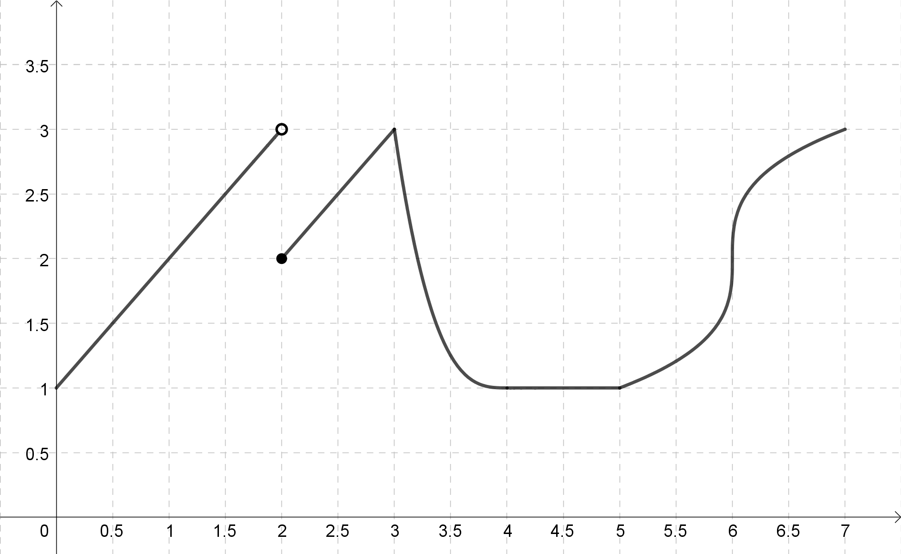

# Introduction

:::{#def-differentiable}
## Differentiability at a Point
A function $f(x)$ is *differentiable at $x=a$* if the limit in the definition of $f'(a)$,
$$
f'(a) = \lim_{h\to 0} \frac{f(a+h)-f(a)}{h},
$$
exists. If this limit does not exist, then $f(x)$ is *not differentiable at $x=a$*.
:::

If $f(x)$ is differentiable at every point in an interval, we say $f(x)$ is differentiable on that interval. In this section, we explore how differentiability is related to continuity, and how we can recognize from a graph or a formula the points where a function fails to be differentiable.

# Discussion Problems

## Problem 1 - Continuity and Differentiability

:::{.callout-note}
## Recall: Continuity at a Point
A function $f(x)$ is *continuous at $x=a$* if $f(a)$ is defined and
$$
\lim_{x\to a} f(x) = f(a).
$$
:::

Sketch the graph of a function that satisfies each description below. If you think such a graph is not possible, try to explain why.

a. A function $f(x)$ that is continuous at $x=a$ but **not** differentiable at $x=a$.
b. A function $f(x)$ that is differentiable at $x=a$ but **not** continuous at $x=a$.

## Problem 2 - Reading Continuity and Differentiability from a Graph
The function $f(x)$ is shown in the graph below.

{width=80%}

a. List all $x$ values for which $f(x)$ is not continuous.
b. List all $x$ values for which $f(x)$ is not differentiable.

## Problem 3 - Gravity Above and Below the Earth's Surface
The acceleration due to gravity, $g$, varies with height above the surface of the earth, in a certain way. If you go down below the surface of the earth, $g$ varies in a different way. It can be shown that $g$ is given by
$$
g = \begin{cases}
\dfrac{GMr}{R^3} & \text{for } r<R \\[2ex]
\dfrac{GM}{r^2} & \text{for } r\geq R,
\end{cases}
$$
where $R$ is the radius of the earth, $M$ is the mass of the earth, $G$ is the gravitational constant, and $r$ is the distance to the center of the earth.

a. Sketch a graph of $g$ against $r$.
b. Is $g$ a continuous function of $r$? Explain your reasoning.
c. Is $g$ a differentiable function of $r$? Explain your reasoning.

## Problem 4 - Zooming In
Graph the function $f(x)=\sqrt{x^2+10^{-35}}$ in [Desmos](https://www.desmos.com/calculator). Do you think the function is differentiable at $x=0$? Explain your reasoning.

## Problem 5 - Differentiability of a Piecewise Function
Let
$$
f(x) = \begin{cases}
(x+1)^2 & \text{if } x\leq 1 \\
4x-2 & \text{if } x>1
\end{cases}
$$

a. Using the limit definition of the derivative, find a formula for $f'(x)$ when $x<1$.
b. Find a formula for $f'(x)$ when $x>1$.
c. True or False: $f'(1)=4$. Explain your reasoning.
