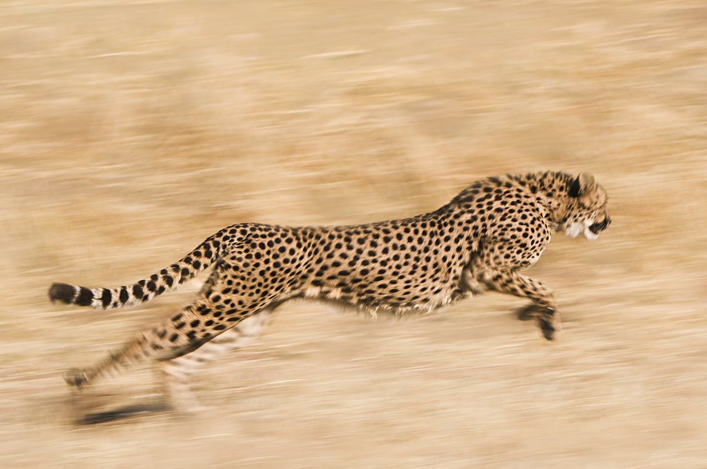

In this unit, we will use limits to introduce one of the central idea of this course: the **derivative**.

To motivate the idea, let's consider the idea of *instantaneous speed*. If we know how far something has traveled over a given interval of time, we can calculate 
$$\frac{\text{Distance Traveled}}{\text{Duration}}$$
This quantity tells us how fast the object was traveling *on average* throughout the time interval. Is it possible to determine how fast the object was traveling at a specific moment? 

### Problem 1: The Cheetah's Speed

::: {layout="[45,45]"}
A cheetah takes off, chasing after a springbok. The image shown to the right was taken 3 seconds after the cheetah began its chase. During those first 3 seconds, the cheetah traveled a distance of 132 ft.


:::

a. Using only the information above, how fast do you think the cheetah was traveling at the moment the picture was taken?

b. Here is some more data about the distance the cheetah had traveled $t$ seconds after it started chasing the springbok:

    | $t$ (sec) | 0 | 0.5 | 1 | 1.5 | 2 | 2.5 | 3 | 3.5 |
    |:---:|:---:|:---:|:---:|:---:|:---:|:---:|:---:|:---:|
    | $d$ (ft) | 0 | 3 | 15 | 33 | 58 | 92 | 132 | 177 |

    Based on this information, what is your best guess for the cheetah's speed at the moment the picture was taken?

c. Is your answer in part (a) different from your answer in part (b)? If so, why do you think your answer in part (b) is better?

d. Is it possible to calculate the instantaneous speed at time $t=3$ from this data? If not, what additional information would you need? Or, is it not possible to actually calculate no matter the available information?

::: {.callout-note collapse="true"}
## Try it: watch the estimate converge

Whatever strategy you used in part (b), you were computing an *average* speed over some interval of time — you don't yet have a way to compute speed at a single instant directly. But your answer in part (b) is probably a better estimate of the cheetah's speed at $t=3$ than your answer in part (a). Why? What is it about the data you used in part (b) that makes it a better estimate?

Here's the catch: the table only tells you the cheetah's position at eight specific moments. You can compute an average speed *between* any two of those moments, but you can't shrink the interval any further than the data allows — there's nothing between $t=2.5$ and $t=3$ to compute with.

To get past that, the plot below fills in the gaps with a smooth curve passing through all eight data points *(a "natural cubic spline," if you're curious — just one reasonable way to interpolate between measurements; it isn't necessarily the cheetah's actual path, just a stand-in that lets us move continuously).* With a continuous curve in hand, you can slide your second point as close to $t=3$ as you like.

```{ojs}
//| echo: false
cheetahData = [
  {t: 0,   d: 0},
  {t: 0.5, d: 3},
  {t: 1,   d: 15},
  {t: 1.5, d: 33},
  {t: 2,   d: 58},
  {t: 2.5, d: 92},
  {t: 3,   d: 132},
  {t: 3.5, d: 177}
]
```

```{ojs}
//| echo: false
// Standard natural cubic spline (Burden & Faires algorithm): returns a
// function d(t) that passes exactly through every point in `data`.
function naturalCubicSpline(data) {
  const xs = data.map(p => p.t);
  const ys = data.map(p => p.d);
  const n = xs.length - 1;

  const h = [];
  for (let i = 0; i < n; i++) h.push(xs[i + 1] - xs[i]);

  const alpha = new Array(n + 1).fill(0);
  for (let i = 1; i < n; i++) {
    alpha[i] = (3 / h[i]) * (ys[i + 1] - ys[i]) - (3 / h[i - 1]) * (ys[i] - ys[i - 1]);
  }

  const l = new Array(n + 1).fill(0);
  const mu = new Array(n + 1).fill(0);
  const z = new Array(n + 1).fill(0);
  l[0] = 1;
  for (let i = 1; i < n; i++) {
    l[i] = 2 * (xs[i + 1] - xs[i - 1]) - h[i - 1] * mu[i - 1];
    mu[i] = h[i] / l[i];
    z[i] = (alpha[i] - h[i - 1] * z[i - 1]) / l[i];
  }
  l[n] = 1;
  z[n] = 0;

  const c = new Array(n + 1).fill(0);
  const b = new Array(n).fill(0);
  const dd = new Array(n).fill(0);
  for (let j = n - 1; j >= 0; j--) {
    c[j] = z[j] - mu[j] * c[j + 1];
    b[j] = (ys[j + 1] - ys[j]) / h[j] - (h[j] * (c[j + 1] + 2 * c[j])) / 3;
    dd[j] = (c[j + 1] - c[j]) / (3 * h[j]);
  }

  return function (x) {
    let i = 0;
    while (i < n - 1 && x > xs[i + 1]) i++;
    const dx = x - xs[i];
    return ys[i] + b[i] * dx + c[i] * dx * dx + dd[i] * dx * dx * dx;
  };
}
```

```{ojs}
//| echo: false
splineFn = naturalCubicSpline(cheetahData)
```

```{ojs}
//| echo: false
curveSample = d3.range(0, 3.501, 0.02).map(t => ({t, d: splineFn(t)}))
```

```{ojs}
//| echo: false
refPoint = ({t: 3, d: splineFn(3)})
```

```{ojs}
//| echo: false
viewof tChoice = Inputs.range(
  [0, 3.5],
  {step: 0.01, value: 2, label: "Compare t = 3 to t =", format: (t) => t.toFixed(2)}
)
```

```{ojs}
//| echo: false
selPoint = ({t: tChoice, d: splineFn(tChoice)})
```

```{ojs}
//| echo: false
slope = Math.abs(tChoice - 3) < 0.005 ? null : (refPoint.d - selPoint.d) / (refPoint.t - selPoint.t)
```

```{ojs}
//| echo: false
Plot.plot({
  width: 500,
  height: 350,
  style: {background: "transparent"},
  x: {label: "t (sec)", domain: [-0.2, 3.7]},
  y: {label: "d (ft)", domain: [-10, 190]},
  marks: [
    Plot.ruleY([0], {stroke: "var(--bs-body-color)", strokeOpacity: 0.4}),
    Plot.ruleX([0], {stroke: "var(--bs-body-color)", strokeOpacity: 0.4}),
    Plot.line(curveSample, {x: "t", y: "d", stroke: "var(--bs-body-color)", strokeOpacity: 0.5}),
    Plot.dot(cheetahData, {x: "t", y: "d", r: 4, fill: "var(--bs-body-color)"}),
    ...(slope !== null
      ? [
          Plot.line([selPoint, refPoint], {x: "t", y: "d", stroke: "#1d70b8", strokeWidth: 2, strokeDasharray: "5,4"}),
          Plot.text([{t: (selPoint.t + refPoint.t) / 2, d: (selPoint.d + refPoint.d) / 2}], {
            x: "t",
            y: "d",
            dy: -10,
            text: [`${slope.toFixed(1)} ft/sec`],
            fill: "#1d70b8",
            fontWeight: "bold"
          })
        ]
      : []),
    Plot.dot([refPoint], {x: "t", y: "d", r: 6, fill: "#e63946"}),
    Plot.dot([selPoint], {x: "t", y: "d", r: 6, fill: "#1d70b8"})
  ]
})
```

<!-- At your chosen point: $t=$ ${tChoice.toFixed(2)} sec, giving $d(t)\approx$ ${selPoint.d.toFixed(1)} ft on the smooth curve.

The average speed between that point and $t=3$ is
$$\text{average speed} = \frac{d(3)-d(t)}{3-t}.$$

Plugging in your chosen point: (${refPoint.d.toFixed(1)} − ${selPoint.d.toFixed(1)}) ÷ (3 − ${tChoice.toFixed(2)}) ${slope === null ? "→ undefined — pick a different point!" : "≈ **" + slope.toFixed(1) + " ft/sec**"}

Now slide your point toward $t=3$ from either side, as close as the slider allows, and watch that number settle down toward a specific value — that settling value is what we mean by the cheetah's *instantaneous* speed at $t=3$.

This is also exactly why a table of measurements alone was never going to be enough: to talk about an instant, you eventually need a *continuous* curve (or a formula) to shrink the interval all the way down to zero, not just as close as your data happens to allow. That's precisely the idea we'll make precise — with an actual formula instead of a fitted curve — in the next section. -->
:::
